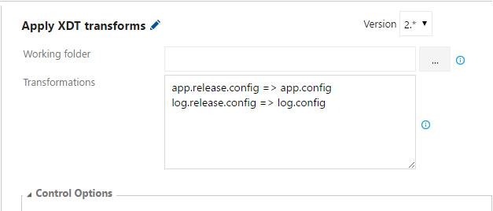

# XDT transform task
Visual Studio Team Services Build and Release extension that applies XDT transforms on XML files.

## Usage
Add a new task, select **XDT Transform** from the **Utility** category and configure it as needed.

Parameters include:
- **Working folder**: the working directory for relative paths. If not specified the default working directory will be used.
- **Transformations**: an absolute or relative comma or newline-separated transformation file rules.

> **Syntax**: {xdt path} => {xml path}[ => {output path}]  
>
> - `web.release.config => web.config` will apply web.release.config to web.config and update the file.  
> - `xdt\web.release.config => config\web.config => web.config` will apply xdt\web.release.config to config\web.config and save the result in web.config.

## Tips
You can use the [XDT tranform task](https://marketplace.visualstudio.com/items?itemName=qetza.xdttransform) to inject tokens in your XML based configuration files configured for local development and then use the [Replace Tokens task](https://marketplace.visualstudio.com/items?itemName=qetza.replacetokens) to replace those tokens with variable values:
- create an XDT transformation file containing your tokens
- setup your configuration file with local developement values
- at deployment time
  - inject your tokens in the configuration file by using your transformation file
  - replace tokens in your updated configuration file

## Debug
You can set the variable `system.debug` to `true` to enable the debug logging on the task to help you investigate unexpected behavior of the task. 
If you cannot fix your issue, open an issue on the github repo and i'll help you :)

# Release notes
**New in 2.1.0**
- Add support for comma separator in _Transformations_ parameters.

**New in 2.0.0**
- **Breaking change**: All previous parameters are now merged in a single line using syntax `{xdt path} => {xml path}[ => {output path}]`.
- Add support for multiple transformations.
- Add _Working folder_ parameter for root of relative paths.

**New in 1.0.0**
- Initial release